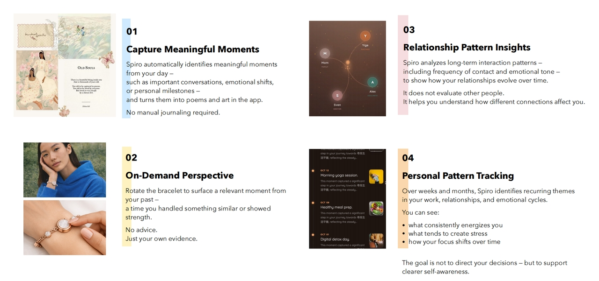
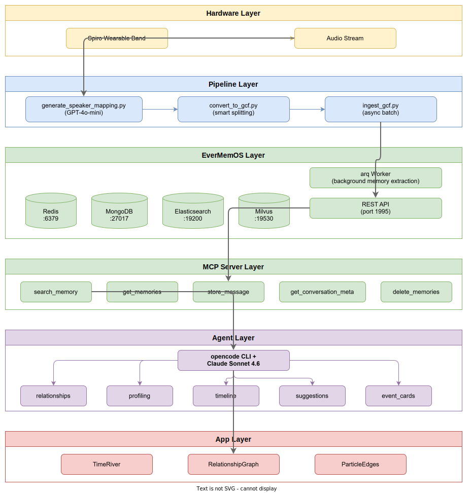

<p align="center">
  
</p>

# Spiro — World-First Context-Native Empathic AI Wearable

> From Life to Language. Carry your days with you.

[](https://github.com/anthropics/evermemos)
[](https://python.org)
[](https://docker.com)

---

<p align="center">
  
</p>

## The Core Tension

Life is becoming clearer. Yet harder to feel. We can record almost everything — steps, sleep, conversations, data. But meaning is fading. Spiro exists to bring meaning back.

---

<p align="center">
  
</p>

## Introducing Spiro

Spiro is a reflective wearable AI that transforms everyday life into language, memory, and meaning. It quietly listens to everyday life and returns lived experience as words. No manual journaling required.

---

<p align="center">
  
</p>

## Features

1. **Capture Meaningful Moments** — Automatically identifies important conversations, emotional shifts, and personal milestones, turning them into poems and art in the app
2. **On-Demand Perspective** — Rotate the band to surface a relevant moment from your past — a time you handled something similar or showed strength. No advice. Just your own evidence.
3. **Relationship Pattern Insights** — Analyzes long-term interaction patterns — including frequency of contact and emotional tone — to show how your relationships evolve over time
4. **Personal Pattern Tracking** — Over weeks and months, identifies recurring themes in your work, relationships, and emotional cycles to support clearer self-awareness

---

<p align="center">
  
</p>

## Hardware

Spiro is a wearable band with a custom-designed PCB, available in silver and gold. Designed as everyday jewelry with embedded AI — always with you, never intrusive.

---

## How It Works — From Audio to Insight

Spiro's pipeline transforms raw audio from the wearable band into meaningful, personalized content through a multi-stage AI pipeline:


1. The band captures ambient audio from daily conversations
2. Gemini 3 Pro processes the audio stream into structured events
3. GPT-4o-mini infers speaker roles (e.g., "Speaker 1" → "Product Manager")
4. Events are converted to GroupChatFormat and ingested into EverMemOS
5. EverMemOS extracts episodic memories and builds searchable indices
6. Claude Sonnet analyzes memories through 5 specialized tasks
7. Results are rendered in the React app as cards, timelines, and relationship graphs

---

## System Architecture



The system follows a layered architecture: the hardware layer captures audio, the data pipeline preprocesses and ingests conversation events, the memory engine (EverMemOS) manages long-term storage and retrieval, the AI agent layer performs analysis via Claude Sonnet, and the presentation layer renders results in a React-based UI.

---

## Quick Start

### Prerequisites

- Docker & Docker Compose
- Python >= 3.10
- [opencode CLI](https://opencode.ai) (`npm i -g @anthropic-ai/opencode` or `curl -fsSL https://opencode.ai/install | bash`)

### Step 1: Initialize

```bash
make init
```

Edit `.env` and fill in your API key:

```bash
# .env
AGENT_MODEL=anthropic/claude-sonnet-4-6
EVERMEMOS_BASE_URL=http://localhost:1995
OPENCODE_API_KEY=your-api-key-here
```

### Step 2: Deploy Services

```bash
make deploy
```

This starts the Docker infrastructure (Redis/MongoDB/Elasticsearch/Milvus), the EverMemOS service, and the arq Worker.

Verify service status:

```bash
make status
```

### Step 3: Prepare Data

#### 3a. Generate Speaker Role Mappings

Use GPT-4o-mini to infer specific roles for each event's speakers (e.g., "Speaker 1" → "Product Manager"):

```bash
make generate-speaker-mappings INPUT=data/basic_events_79ef7f17.json
# Optional: MODEL=gpt-4o-mini  CONCURRENCY=10  DRY_RUN=1
```

Outputs `data/speaker_mappings.json` with per-event speaker role mappings. Supports resumption (already-processed events are skipped); use `--force` to regenerate.

#### 3b. Convert to GCF

Convert raw event data to GroupChatFormat, automatically applying the embedded speaker role mappings:

```bash
make convert-gcf INPUT=data/basic_events_79ef7f17.json
# Optional: LIMIT=10  SPLIT_FRAGS=8  SPLIT_TURNS=100
```

### Step 4: Ingest Data

```bash
make ingest-gcf
# Optional: INPUT=data/gcf_all.json  API_URL=http://localhost:1995/api/v1/memories  CONCURRENCY=5
```

Asynchronous concurrent ingestion with dual progress bars (file-level + message-level), default concurrency of 5.

### Step 5: Run Analysis

```bash
# Relationship analysis
make run-task TASK=relationships USER_ID=79ef7f17-9d24-4a85-a6fe-de7d060bc090

# User profiling
make run-task TASK=profiling USER_ID=79ef7f17-9d24-4a85-a6fe-de7d060bc090

# Timeline
make run-task TASK=timeline USER_ID=79ef7f17-9d24-4a85-a6fe-de7d060bc090

# Suggestions
make run-task TASK=suggestions USER_ID=79ef7f17-9d24-4a85-a6fe-de7d060bc090

# Event cards
make run-task TASK=event_cards USER_ID=79ef7f17-9d24-4a85-a6fe-de7d060bc090
```

Optional parameters:

| Parameter | Applicable Tasks | Description |
|-----------|-----------------|-------------|
| `FOCUS_PERSON=xxx` | relationships | Focus analysis on a specific person |
| `START_DATE=2024-01-01` | timeline | Start date filter |
| `END_DATE=2024-12-31` | timeline | End date filter |
| `KEYWORDS="k1 k2"` | timeline | Keyword filter |

Analysis results are saved in the `output/` directory (JSON format with metadata envelope).

### Step 6: Stop Services

```bash
make stop
```

### End-to-End Workflow

```bash
make init                  # Initialize environment
make deploy                # Start all services
make status                # Confirm services are ready

# Data preprocessing
make generate-speaker-mappings INPUT=data/basic_events_79ef7f17.json
make convert-gcf INPUT=data/basic_events_79ef7f17.json
make ingest-gcf            # Ingest GCF data

# Run all analysis tasks
make run-task TASK=relationships USER_ID=79ef7f17-9d24-4a85-a6fe-de7d060bc090
make run-task TASK=profiling    USER_ID=79ef7f17-9d24-4a85-a6fe-de7d060bc090
make run-task TASK=timeline     USER_ID=79ef7f17-9d24-4a85-a6fe-de7d060bc090
make run-task TASK=suggestions  USER_ID=79ef7f17-9d24-4a85-a6fe-de7d060bc090
make run-task TASK=event_cards  USER_ID=79ef7f17-9d24-4a85-a6fe-de7d060bc090

make stop                  # Clean up
```

---

## Project Structure

| Directory | Description |
|-----------|-------------|
| [`agent/`](agent/README.md) | AI Agent analysis module — 5 task types powered by Claude Sonnet |
| [`pipeline/`](pipeline/README.md) | Data preprocessing — speaker mapping, GCF conversion, ingestion |
| [`mcp_server/`](mcp_server/README.md) | MCP Server bridging EverMemOS and AI agents |
| [`shared/`](shared/README.md) | Shared utilities — EverMemOS async API client |
| [`data/`](data/README.md) | Datasets — 832 conversation events |
| [`app_demo/`](app_demo/README.md) | React visualization UI |
| `EverMemOS/` | Memory engine (git submodule) — [docs](EverMemOS/docs/) |
| `opencode/` | opencode CLI (git submodule) |

---

## Advanced Usage

### Speaker Role Inference

Raw data contains many anonymous speaker labels (e.g., "Speaker 1/Female", "Unknown Participant A"). `generate_speaker_mapping.py` resolves this by:

1. Sending each event's conversation content (including title and type) to GPT-4o-mini
2. The model infers specific roles for each speaker based on conversational context
3. Results are embedded in the `event.object.speaker_mapping` field of `data/basic_events_79ef7f17.json` and automatically applied during GCF conversion

Example mappings:
- `Speaker 1/Female` → `Product Manager`
- `Speaker 2/Male` → `Backend Engineer`
- `Speaker 1` → `Husband`
- `Unknown Participant A` → `Client`

Out of 832 events, 765 successfully generated specific role labels, totaling 3,975 labels.

### Environment Variables (`.env`)

| Variable | Description | Default |
|----------|-------------|---------|
| `AGENT_MODEL` | Model used by opencode | `anthropic/claude-sonnet-4-6` |
| `EVERMEMOS_BASE_URL` | EverMemOS API URL | `http://localhost:1995` |
| `OPENCODE_API_KEY` | API Key (via uniapi proxy) | — |

### opencode Configuration (`opencode.json`)

```json
{
  "provider": {
    "anthropic": {
      "options": {
        "apiKey": "{env:OPENCODE_API_KEY}",
        "baseURL": "https://api.uniapi.io/claude/v1"
      },
      "models": {
        "claude-sonnet-4-6": { "name": "Claude Sonnet 4.6" }
      }
    }
  },
  "mcp": {
    "evermemos": {
      "type": "local",
      "command": ["python", "-m", "mcp_server.server"]
    }
  }
}
```

### MCP Tools

The agent can call the following tools via MCP during analysis:

| Tool | Description |
|------|-------------|
| `search_memory` | Search memories (keyword/vector/hybrid/rrf/agentic) |
| `get_memories` | Retrieve memories by type (episodic/profile/foresight/event_log) |
| `store_message` | Store a new message |
| `get_conversation_meta` | Get conversation metadata |
| `delete_memories` | Delete memories |

### Task Parameters

| Parameter | Applicable Tasks | Description |
|-----------|-----------------|-------------|
| `FOCUS_PERSON=xxx` | relationships | Focus analysis on a specific person's relationships |
| `START_DATE=2024-01-01` | timeline | Start date for timeline range |
| `END_DATE=2024-12-31` | timeline | End date for timeline range |
| `KEYWORDS="k1 k2"` | timeline | Filter by keywords |

### Infrastructure

Docker services (via `EverMemOS/docker-compose.yaml`):

| Service | Port | Purpose |
|---------|------|---------|
| Redis | 6379 | Cache + task queue |
| MongoDB | 27017 | Document storage |
| Elasticsearch | 19200 | Full-text search |
| Milvus | 19530 | Vector search |
| EverMemOS | 1995 | Memory management API |

### All Make Commands

```bash
make help                       # Show all available commands
make init                       # One-click init: submodules + dependencies + env template
make deploy                     # One-click deploy: Docker + EverMemOS + Worker
make stop                       # Stop all services
make status                     # Check service status
make add-memory                 # Store a single memory
make generate-speaker-mappings  # LLM batch speaker role mapping
make convert-gcf                # Convert data to GroupChatFormat
make ingest-gcf                 # Async batch ingest GCF files into EverMemOS
make run-task                   # Run analysis task
make export-demo                # Export task outputs to app_demo/data/ for static demo
make demo                       # Start the demo app (requires npm)
make backup                     # Backup EverMemOS data (MongoDB dump)
make restore                    # Restore EverMemOS data from backup
make lint                       # Run code checks
make test                       # Run tests
make clean                      # Clean temporary files
```

### Development

```bash
pip install -e ".[dev]"    # Install dev dependencies
make test                  # Run tests
make lint                  # Code linting
make clean                 # Clean cache and temporary files
```

---

## Built With

- [EverMemOS](https://github.com/anthropics/evermemos) — Long-term memory engine
- [Claude Sonnet 4.6](https://anthropic.com) — AI analysis via opencode
- [Gemini 3 Pro](https://ai.google.dev) — Audio processing
- GPT-4o-mini — Speaker role inference
- React + D3.js — Visualization
- Docker — Infrastructure orchestration

Built for the [EverMemOS Competition](https://github.com/anthropics/evermemos)
